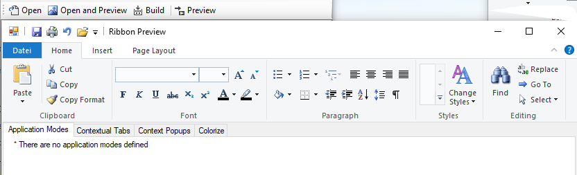

## WindowsRibbon

Windows Ribbon for WinForms

Windows Ribbon for WinForms is a .NET wrapper for Windows 7 Ribbon control. It will allow WinForms developers to use Microsoft Windows 7 Ribbon control in their WinForms applications. Later versions of Windows (Windows 8, Windows 10) are welcome.

WindowsRibbon is sometimes called UIRibbon. The former development title is Scenic.

# **Project Description**

 Windows Ribbon for WinForms is a .NET wrapper for Windows 7 Ribbon control.
 It will allow WinForms developers to use Microsoft Windows 7 Ribbon control in their WinForms applications.

The project includes the library RibbonLib, which adds support for Windows Ribbon to WinForms application and sample applications, written both in C# and VB.NET, that demonstrates the use of the library and the different Ribbon features available.

Check Arik Poznanski's blog for more details on how to use the windows ribbon at 
[http://blogs.microsoft.co.il/blogs/arik/](http://blogs.microsoft.co.il/arik/2009/09/) Also have a look at this  [Quick Start Tutorial](https://bernhardelbl.wordpress.com/2010/11/17/quickstart-tutorial-windows-ribbon-for-winforms/)
Note: you must have the Windows 7 SDK (or later) installed in order to compile the project. 

Following is the list of sample application and their description: 

- **01 - AddingRibbonSupport** - Empty WinForms application with basic Ribbon support.
- **02 - ApplicationMenuButton** - WinForms application with Ribbon that contains an application menu with some buttons.
- **03 - MenuDropDown** - WinForms application with DropDownButton and SplitButton inside an application menu.
- **04 - TabGroupHelp** - WinForms application that uses Tabs, Groups and HelpButton.
- **05 - Spinner** - WinForms application that demonstrates the use of a Spinner control in the ribbon.
- **06 - ComboBox** - WinForms application that demonstrates the use of a CombBox control in the ribbon.
- **07 - RibbonColor** - WinForms application that shows how to change the ribbon global colors.
- **08 - Images** - WinForms application that shows how to work set images dynamically in the ribbon.
- **09 - Galleries** - WinForms application thats uses DropDownGallery, SplitButtonGallery and InRibbonGallery.
- **10 - CheckBox** - WinForms application that uses CheckBox and ToggleButton control in the ribbon.
- **11 - DropDownColorPicker** - WinForms application that demonstrates the use of a DropDownColorPicker control in the ribbon.
- **12 - FontControl** - WinForms application that demonstrates the use of a FontControl control in the ribbon.
- **13 - ApplicationModes** - WinForms application that demonstrates the use of ApplicationModes.
- **14 - ContextualTabs** - WinForms application that demonstrates the use of ContextualTabs.
- **15 - ContextPopup** - WinForms application that demonstrates the use of ribbon context popups.
- **16 - RecentItems** - WinForms application that demonstrates the use of ribbon recent items.
- **17 - QuickAccessToolbar** WinForms application that demonstrates the use of quick access toolbar.
- **18 - SizeDefinition** WinForms application that demonstrates the use of custom layout templates.
- **19 - Localization** WinForms application that demonstrates how to localize your ribbon.

see also:
[Codeplex archive](https://archive.codeplex.com/?p=windowsribbon)

[Documentation archive](https://www.codeproject.com/Articles/55599/Windows-Ribbon-for-WinForms-Part-Table-of-Conten)

[Current Documentation](https://github.com/harborsiem/WindowsRibbon/blob/master/Documentation/WindowsRibbon.pdf)

Thanks to Arik Poznanski and Bernhard Elbl for the great work.

Now the WindowsRibbon project is running also in the latest Visual Studio Versions 2017 and 2019. Have a look to the file "HowToUse.md" to see how to use the WindowsRibbon in a .NET WinForms application. In the Releases page of this Github repository there are also zipped *.msi setup files for the components. The msi files are build with the WIX Toolset.

There is also a gui and console based design, build and preview tool called RibbonTools. 

The C# samples are added with a more complex Mainform application. Here you can see the Ribbon of Mainform in the RibbonTools app.

An other C# Application with the Ribbon Control one can find at the following page:

[ElementViewer](https://github.com/harborsiem/ELEMNTViewer)